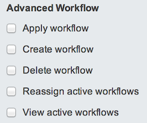
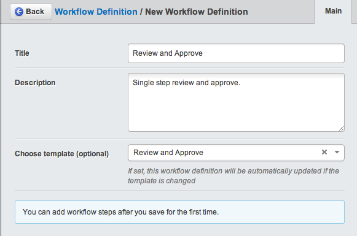

# Advanced Workflow Module

Note: The SilverStripe 2.4 version of the module is available from the ss24
branch of the repository.

## Overview

A module that provides an action / transition approach to workflow, where a
single workflow process is split into multiple configurable states (Actions)
with multiple possible transitions between the actions.

## Requirements

 * SilverStripe Framework and CMS 3.1 or newer
 * (Optional) [Queued Jobs module](https://github.com/nyeholt/silverstripe-queuedjobs) (for embargo/expiry functionality)

## Installation

The workflow extension is automatically applied to the `SiteTree` class (if available). In order to apply workflow to other classes (e.g. `MyObject`), you need
to apply it to both the model class and the controller
which is used for editing it. Here's an example for `MyObject`
which is managed through a `MyObjectAdmin` controller,
extending from `ModelAdmin`. `mysite/_config/config.yml`:

	:::yml
	MyObject:
	    extensions:
	        - WorkflowApplicable
	MyObjectAdmin:
	    extensions:
	        - AdvancedWorkflowExtension

The workflow engine can send out email reminders if a workflow has been open for longer
than a couple of days (configurable in each "Workflow Definition" through the CMS).
Here's how to set up a cronjob for those:

	*/1 * * * * cd /var/www && sudo -u www ./sapphire/sake dev/tasks/WorkflowReminderTask

## Concept

In its most basic sense, workflow means that new content or changes to existing content, need to go through an approval process before they're able to be
published to the live site. This works by limiting access to certain parts of the workflow to certain users, using the standard SilverStripe CMS Security admin.

The CMS can have an unlimited number of workflows created and running within it, but only one workflow can be attached to a content-object (e.g a "Page") at any one time.

Each workflow comprises a number of definable "Actions" such as "Publish" and "Reject" and each action may have any number of "Transitions" leading out from it
that connect one action to another.

Users and groups can have individual permissions assigned to them on Transitions, which gives workflow administrators fine-grained control over the content-actions
allowed to be performed. Each transition the current CMS user has permission to enact, will be available to them as a button on each item of content assigned to them.

## Terminology

 * **Workflow Definition**: Description of all the "actions" and "transitions" comprising a single workflow. Definitions are applied to pages within the CMS and are managed through the "Workflows" section of the CMS.
 * **Workflow Instance**: When a user wants to publish a page, instead of selecting the 'publish' button, they instead start a workflow, or more specifically, an instance of the
"Workflow Definition" applied to that page. This "Instance" contains all the relevant data (e.g. user choices, comments, etc) for the running workflow on that content.
 * **Workflow Action**: A workflow can have many actions. Actions describe a single process occurring at each workflow step. Each piece of workflow logic is encapsulated in an action,
such as assigning users, publishing a page, or sending notifications.
 * **Workflow Transition**: A transition is a 'pathway' between two actions, and defines how a workflow should proceed from one action to another. You can chain transitions, or have the user choose between different ones (e.g. "approve" vs. "reject")

## Configuration

Since the actual workflows can vary greatly for each site, there's no default
workflow set up. You'll need to configure it through the `admin/workflows` admin interface.
Here, we'll create a simple two step workflow with the following features:

1. Assigns a content-change to the "Editors" group for initial approval
2. Notifies the editors of their pending content change
3. Upon Editor approval, assigns the change to the "Manager" group for final approval
4. Notifies the Managers of their pending content change
5. Upon Manager approval, the content-item is Published
6. Upon Manager rejection, the content item is not published and the workflow is cancelled

### Adding Groups and Users

First of all, login to the CMS as an administrator. Ensure you have "Authors", "Editors" and "Managers" groups created with a single user linked to each group (in the standard "Security" admin). Assign the three "Advanced Workflow" permissions to each group.

### Creating Your Workflow Definition From a Template

The easiest way to get up and running with workflow
is to use a "workflow template" in order to create your definition. 
To find out the detailed steps of creating and customizing actions and transitions, see to "Customizing Actions and Transitions" instead.

Switch to the "Workflow" section in the CMS menu. 
Create a new workflow there through the "Add Workflow Definition" button. 
Choose "Review and Approve" from the template dropown.
After saving the item, assign it to the "Editors" group

Now continue to "Assigning Workflow to Content" below.

### Importing and Exporting Workflows

In the Workflow CMS admin-area, authorised users are able to export a WorkflowDefinition from one SilverStripe installation, and import
it into another.

To export a workflow; from the table of workflows in the Workflow CMS admin-area, select the 'download' icon located to the right of the 'edit' and 'delete' icons.

You should be prompted to download a file which you should save to your local computer.

To import, simply login to another SilverStripe installation and navigate to the Workflow Admin of that CMS. You should see an "Import" heading
at the bottom of the central CMS pane with a "Browse" button below that.

Select the "Browse" button and locate the downloaded file in the your computer's file-browser that will automatically appear, then select the
"Import Definition" button. That's it!

#### Exported related user and group Data

Because users and groups can be related to Workflow Actions and Transitions, these associations are also exported. However, these relations will only
be made at the import stage if the same Groups and/or Users also exist in the target CMS, otherwise you will need to manually re-create the users and groups
and re-assign them to the imported workflow.

### Assigning Workflow to Content

At this point your new workflow isn't much use if your existing CMS content isn't aware of it. Select the "Pages" left-hand menu item,
create new page called "Workflow Test", then select the "Settings" tab and then the "Workflow" tab. Note: the default workflow selection is "Inherit from parent"
so you can assign a workflow to a parent page and each child page will use that workflow without any further configuration.

However, you might want one specific page to use a different workflow than its parent, so in this case select the "My New Workflow" option from the drop-down menu
and select "Save draft" or "Save and Publish" as usual.

Your new workflow has now been associated with your new page. If you select the "Content" tab, you should notice a new button available labeled as per your
first workflow action, which should be "Apply for approval" - if you've followed the instructions above.

### Testing and Using Your New Workflow

Logout of the CMS and log back in again as your "Author" user.
Navigate to the page you created in the previous step, enter some text into the "Content" area and then select the "Save Draft" button.
Once the page had reloaded, ''then'' select the "Apply for approval" button, now depending on users and groups assigned to your transitions and
content-permissions, the content may now be locked from further editing until it has progressed through the workflow instance to the final Manager's
"Publish item" action.

Notice that if you select the "Workflows" left-hand navigation menu item once again, you should see a list of your "Submitted items".
At this point this should be showing a single entry for the "Workflow Test" page. You can refer back to this list and observe the "Current action" column
update as your changes progress though the workflow.

Depending on how you configured the email address for the Editor user you created in the "Security" admin before starting, an email should have been received
in the Editor's email inbox alerting them that some new content is available for review/approval by them.

Now logout of the CMS and log back in again as a user from the "Editors" group. Select the "Workflows" left-hand navigation menu item, and notice that you have
a similar list to before, but this one is entitled "Your pending items". These are the workflow changes automatically assigned to you that are now awaiting your 
attention.

Click anywhere on the table row and in the "Next Action" drop-down menu, make your choice as Editor, then select "Save". You can also see a log of the actions.
Note: You are also able to select the blue content-title text to view the page itself within the CMS and manually review the changes before committing to
accepting or rejecting them. If you now go back to the "Workflow" admin, you'll notice that the items that was in the "Your Pending Items" list, is no longer
there, as the action is now with the users of the "Managers" group.

Logout of the CMS, and login as your "Manager" user. Select the "Workflows" left-hand navigation menu item, and notice that there is a similar list to before
entitled "Your pending items", again with the "Workflow Test" page being the only item. Click on this item and make your selection as manager, and then select
the "Save" button.

If you were to go and check the edit screen for this page, you'll notice now that having gone through the full workflow, that the action button at the bottom,
now shows "Apply for approval" once again, and logging back-in as an Author, this user is now able to make further changes.

## Embargo and Expiry

This add-on functionality allows you to embargo some content changes to only appear as published at some future date. To enable it,
add the `WorkflowEmbargoExpiryExtension`.

	:::yml
	SiteTree:
	    extensions:
	        - WorkflowEmbargoExpiryExtension

Make sure the [QueuedJobs](https://github.com/nyeholt/silverstripe-queuedjobs) 
module is installed and configured correctly.
You should have a cronjob similar to the following in place, running 
as the webserver user.

	*/1 * * * * cd  && sudo -u www php /var/www/framework/cli-script.php dev/tasks/ProcessJobQueueTask

It also allows for an optional subsequent expiry date. Note: Changes to these dates also constitute modifications to the content and as such
are subject to the same workflow approval processes, where a particular workflow instance is in effect. The embargo export functionality can also be used independently of any workflow. 

## Usage

### Requesting publication (authors)

Depending on the specific permissions content authors have, authors may only have the ability to create or edit content and to request publication,
but not to actually publish content - making it publicly viewable - themselves.

 * **Content Author - Non-admin**: To request publication, save your page using the "Save Draft" button on the bottom menu of the Editing Pane. Once your content has been saved within the CMS, you can then request publication by pressing the "Apply for Approval" button (or equivalent, depending on
how your workflow has been setup) in the same bottom menu of the Editing Pane.
 * **Content Publisher - Admin**: You will be asked to add a comment about your edits. This comment will become a part of the audit trail for your content, and we recommend adding this information.
However, it is not enforced, and can you can safely proceed while leaving this field blank.

Depending on how your workflow is setup, users and/or groups configured with "approval" permissions will be alerted via email and be able to login to the CMS and
see your page as a pending approval request when they view the workflow admin. The publisher will then need to review your request and if happy, will likely
publish it.   

### Approving and publishing content (editors / managers)

Depending on the setup of workflow, publishers may receive an e-mail when authors have requested publication. Publishers then select the 'Workflow' navigation
item to view a report of pending items and by selecting one form the list, be able to access the approval step. In the following screen, the drop-down menu will display the next approval step based on the workflow for this page. Publishers are also able to enter in comments here, detailing their approval or cancel/deny the approval if necessary.

## Advanced Transitions

Sometimes an action will have a single transition from itself to the next action; when the workflow begins execution,
these actions are executed immediately one after another. An example of this might be when you want to assign a user to the workflow,
then notify them immediately; the "Assign" action will have a single transition to the "Notify" action.

If you want the user to make an explicit choice about which path of the workflow to move to after a certain action,
there should be multiple transitions created going out from that action. Continuing the above flow; after Notifying users,
you might want them to make a decision as to whether to "Approve" or "Reject" the item; therefore, from the Notify action, there may be two transitions:

1). The Approve transition that leads to the approval and publication actions.
2). The Reject transition that leads to the cancel action.

The name given to a transition appears on the "Workflow Actions" tab of a content item when a content author needs to make a decision.

Each action may have an arbitrary number of outbound transitions, and transitions can loop around back to earlier parts of the workflow too!

## Customizing Actions and Transitions

Initially we created a two-step workflow from a "workflow template".
The workflow system is very powerful, so we'll run you through
creating the same setup manually. That's a good way to learn the nuts
and bolts of how things fit together, and will enable you to
customize your workflow to your needs.

We assume you've got users and groups set up already.
Now, wwitch to the "Workflow" section in the CMS menu. Create a new workflow there
through the "Add Workflow Definition" button. Call it "Two-step workflow" for now. After saving the item, assign it to the "Editors" group

**Actions**

1. You should have noticed a new item appear in the main CMS content-area entitled; "Workflow". 
2. From its drop-down menu, select the "Assign Users To Workflow Action" option and then select the "Create" button.
3. In the popup dialogue that appears, type the title: "Apply for approval" (Note: the first workflow action's title is used for the apply button's label in the CMS UI)
4. Leave everything else as-is, but in the "Groups" drop-down menu - locate and select the "Editors" group, then select "Save"
5. Create another action, this time selecting the "Notify Users Workflow Action" option. Call it "Notify Editors". Leave everything-else as-is, but because this action sends emails, enter an email subject, a from-address and email-body template (see the "Formatting Help" menu at the bottom of the popup dialogue), then click Save.
6. Create another action and select the "Simple Approval Workflow Action" option, select the "Create" button and in the popup, give it the title "Editor Approval", then select "Save". Note: in a simple workflow such as this, the approval action doesn't actually do anything. However, it's good practice to have it as it provides a clear reference point of where approval occurs. In a more complex workflow, you might use a "Counting Approval" action to do things like count the number of people who have approved.
7. Create another action "Assign Users To Workflow Action", and entitle this one "Assign Managers". Leave everything else as-is and locate and select the "Managers" group from the "Groups" drop-down, then select "Save".
8. Create another action "Notify Users Workflow Action", and name it "Notify Managers". Leave everything-else as-is, but like the previous "Notify Users Workflow Action", enter the email-specific details, then select "Save".
9. Create another action "Simple Approval Workflow Action" and name it "Manager Approval", selecting "Save" when you’re done.
10. Create another action "Publish Item Workflow Action" and call it "Publish item", leave everything else as-is and select "Save" when you’re done.
11. Create another action "Cancel Workflow Action", call it "Cancel", leave everything else as-is, and select "Save" when you’re done.

Okay, now we need to join up these actions using transitions, so that users can make the appropriate choices.

**Transitions**

* On your "Apply for approval" action in the list of actions you just created in the above step, select the "Add Transition" button and in the popup dialogue that appears, entitle the transition "Send Notification", leave everything else as-is and select "Notify Editors" as the "Next Action", then select the "Save" button.
* On your "Notify Editors" action, select the "Add Transition button and call this one "Wait for approval" and select "Editor Approval" as the "Next Action", then select the "Save" button.
* On your "Editor Approval" action, select the "Add Transition" button and call this one "Approve", select "Assign Managers" as the "Next Action".
* Create another transition on the "Editor Approval" action, call this one "Reject" and select "Cancel" as the "Next Action", then select the "Save" button - you've just created your first decision point.
* On the "Assign Managers" action, add a transition and call it "Notify Managers", select "Notify Managers" as the next action, then select "Save".
* On the "Notify Managers" action, add a transition and call it "Wait for approval" and select "Manager Approval" as the next action, then select "Save".
* On the "Manager Approval" action, add a transition and call it "Accept and Publish" and select "Publish item" as the next action.
* Create another transition on the "Manager Approval" action and call it "Reject and Cancel", then select "Cancel" as the next action, then select "Save".
* Select the "Save" button at the bottom of the screen to finalize your workflow, and you're done.

## Contributing

### Translations

Translations of the natural language strings are managed through a third party translation interface, transifex.com. Newly added strings will be periodically uploaded there for translation, and any new translations will be merged back to the project source code.

Please use [https://www.transifex.com/projects/p/silverstripe-advancedworkflow](https://www.transifex.com/projects/p/silverstripe-advancedworkflow) to contribute translations, rather than sending pull requests with YAML files.