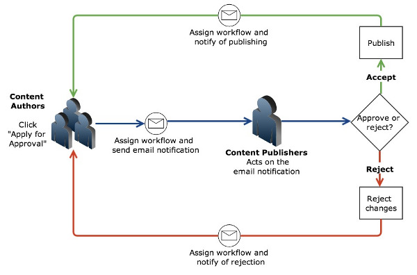
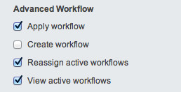
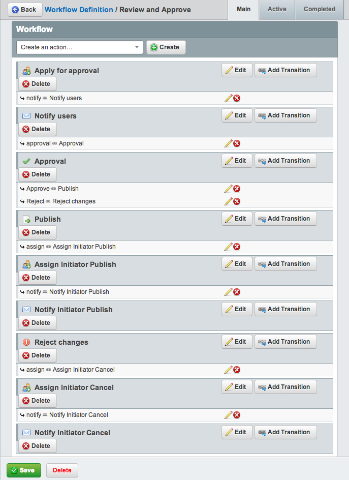
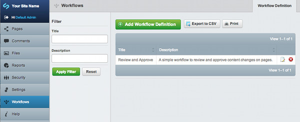
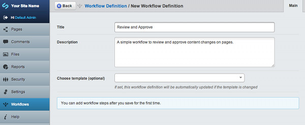
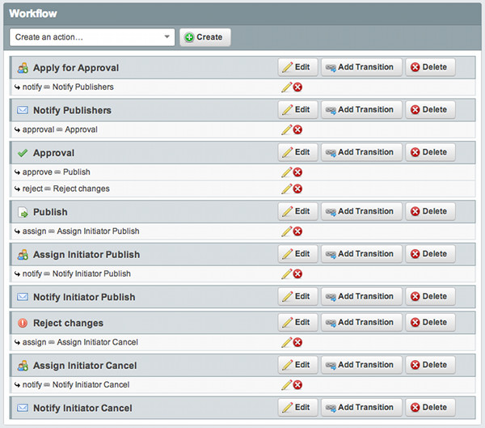
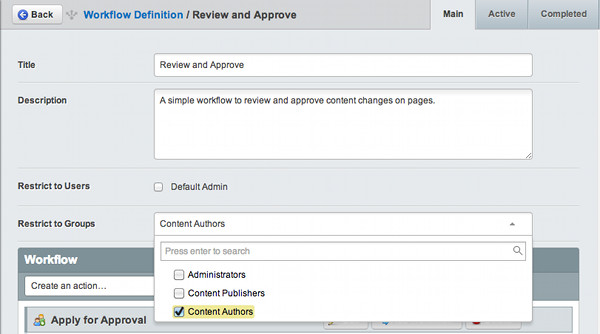
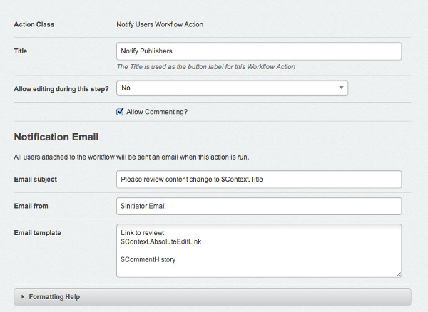
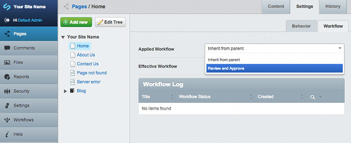

# Setting up a simple CMS workflow
Since workflows can vary greatly across websites, there's no default workflow. 

You will need to configure the workflow in the ‘workflows’ admin interface. Here, we'll create a simple ‘Review and Approve’ workflow with the following features:
1. Content Authors make a change and request approval from Content Publishers.
1. An email is sent to the Content Publishers for Approval.
1. Content Publishers can view and then reject or approve the change.
1. An email is then sent to Content Authors to notify them of the rejection or that the content is to be published.

## **Step 1. Set up user groups**
CMS Administrators must first set up user groups to be configured in the Workflow, _see_ [Changing and managing users](https://userhelp.silverstripe.org/en/managing_your_website/changing_and_managing_users/) _for setting up users and groups in the Secuirty admin_. 

For this example workflow we have the following user groups set up: 
1. Content Authors
-- The users creating and maintaining content on the website. These users will change content and apply for approval.
1. Content Publishers
-- The users who will review and approve any content changes on the website before they are published to the live web site.

You must ensure the above user groups have the following permissions checked:

Once your user groups are set, you can apply Workflow actions to these user groups. 

See [more on workflow permissions.](workflow-permissions.md)

[note]
Note: Any user with ‘full administrative rights’ set will see all Workflow action buttons in the CMS, plus they will have the ability to Publish and Draft content regardless of whether or not a workflow is configured on a page.
[/note]

## **Step 2. Create a Workflow Definition**
There is no default workflow in SilverStripe CMS since actual workflows vary greatly across web sites and hence one must be created. 

### Using a workflow template (optional)
Workflow provides a simple "Review and approve" template that can be selected when setting up a Workflow Definition. 
This is a 2 step workflow (one person authors content and another approves and publishes it) that you can use as a starting point for more complex workflows.
Once you have added a template, you will need to configure it with your custom settings.

Now continue to "Step 4. Assigning Users to the Workflow" below.

### Defining your own workflow
* To create a Workflow Definition, select the _Workflows_ admin in the Left Hand Menu to show the Workflow administration.

* Click on ‘Add Workflow Definition’ to bring up the Workflow form.

* Enter:

**Title**
The title for your workflow.

**Description**
A summary of your workflow.

**Choose from Template (optional)**
As detailed above, a template can be selected here. 

* Click ‘Save’ 

### Note:
You must save your workflow definition before you can add workflow actions.

## **Step 3. Adding Workflow Actions**
Once you have saved your Workflow Definition you can now add Workflow Actions to it. 

Workflow Actions are ‘triggers’ for the next process in a workflow such as notifications or publishing content. 

The following example will configure a simple Review and Approve workflow. First, create all your actions to match your desired workflow process and then create the transitions from each action.

From the ‘Create an action” drop down, select the following actions:

1. **Assign Users To Workflow Action**: Title this “Apply for Approval”.
This creates a Workflow Button on a page, which then assigns the workflow process to configured users.
1. **Notify Users Workflow Action**: Title this “Notify Publishers”. This action configures the notification emails sent when an action is triggered. 
1. **Simple Approval Workflow Action**: Title this “Approval”. This provides the decision point and two buttons to Publish or Reject the current content change.
1. **Publish Item Workflow Action:** Title this “Publish”. This provides a button to register approval to proceed with publishing the content.
1. **Assign Users To Workflow Action**: Title this “Assign Initiator Publish”. This action selects the Content Authors to be notified by email that their content is to published.
1. **Notify Users Workflow Action:** Title this “Notify Initiator Publish”. This action emails the above “initiator” to Publish the content they have changed.
1. **Cancel Workflow Action**: Tile this “Reject Changes”. This provides a button to register rejection of  changes.
1. **Assign Users To Workflow Action**: Title this “Assign Initiator Cancel”. This actions selects the Content Authors who are to Reject the changes.
1. **Notify Users Workflow Action**: Title this “Notify Initiator Cancel”. This actions emails the above “initiator” to not publish what is changed. 

Next, add your transitions as in the below example, by clicking “Add Transition” on each action, setting a title and a "next Action":

As you can see in the above workflow, the “Approval” action is the decision point at which one of the two transitions to either Publish or Reject actions is selected.

Once either action button is pressed, the workflow is assigned back to the original initiator, and an email  notification is triggered (email is configured in the “Notify Initiator Cancel” or “Notify Initiator Publish” action).

## **Step 4. Assigning Users to the Workflow**
When you have all the Workflow Actions and Transitions created you must assign the workflow to users in two areas.

The first is the workflow process itself, that is, which users will be restricted to the workflow. 

This is set via the Workflow Definition ‘Restrict to Users’ or ‘Restrict to Groups’ fields. In this example, we apply the workflow restrictions to Content Authors who wish to make content changes. Select "Content Authors" from the drop down.

Next, you must assign the correct users to each action. For example when a Content Author triggers the workflow, it is the Content Publishers who must then receive and action the next step in the workflow process. 

First select the “Edit” button on the "Apply for approval" action.

For this workflow action, select the Content Publishers Security group. These users will now receive the email notifications of content changes in the workflow once the “Apply for Approval” button is clicked by Content Authors.

Next, select the "Notify Publishers" action and fill out the "Notification Email". You can use several placeholders to create your email template. Set the from email, address, and subject fields. See the "Formatting Help" drop down for help.

Repeat these steps for the other actions (assign and notify) but this time setting the user to the "Initiator".

[note]
You can further restrict certain actions and transitions to specific users if desired using the “User” check boxes and the “restricted users” tabs on transition forms.
[/note]

## **Step 5. Assign Workflows to a Page**

To make use of workflows you need to assign a workflow definition to your content pages. 

To do this:

 1. Select the page you wish a workflow to be applied to
 2. Select the ‘Settings’ tab 
 3. Select the ‘Workflow’ tab
 4. Select the desired workflow from the ‘Applied Workflow’ drop down
 5. Save your page

Your workflow has now been associated with your page (or section of pages). If you select the "Content" tab, you should notice a new button available labeled as per your
first workflow action. For example this may read "Apply for approval"

Note: the default workflow selection is "Inherit from parent" so you can assign a workflow to a parent page and each child page will use that workflow without any further configuration.

## Testing and Using Your New Workflow

Logout of the CMS and log back in again as your "Author" user.
Navigate to the page you created in the previous step, enter some text into the "Content" area and then select the "Save Draft" button.
Once the page had reloaded, ''then'' select the "Apply for approval" button, now depending on users and groups assigned to your transitions and
content-permissions, the content may now be locked from further editing until it has progressed through the workflow instance to the final Manager's
"Publish item" action.

Notice that if you select the "Workflows" left-hand navigation menu item once again, you should see a list of your "Submitted items".
At this point this should be showing a single entry for the "Workflow Test" page. You can refer back to this list and observe the "Current action" column
update as your changes progress though the workflow.

Depending on how you configured the email address for the Editor user you created in the "Security" admin before starting, an email should have been received
in the Editor's email inbox alerting them that some new content is available for review/approval by them.

Now logout of the CMS and log back in again as a user from the "Editors" group. Select the "Workflows" left-hand navigation menu item, and notice that you have
a similar list to before, but this one is entitled "Your pending items". These are the workflow changes automatically assigned to you that are now awaiting your 
attention.

Click anywhere on the table row and in the "Next Action" drop-down menu, make your choice as Editor, then select "Save". You can also see a log of the actions.
Note: You are also able to select the blue content-title text to view the page itself within the CMS and manually review the changes before committing to
accepting or rejecting them. If you now go back to the "Workflow" admin, you'll notice that the items that was in the "Your Pending Items" list, is no longer
there, as the action is now with the users of the "Managers" group.

Logout of the CMS, and login as your "Manager" user. Select the "Workflows" left-hand navigation menu item, and notice that there is a similar list to before
entitled "Your pending items", again with the "Workflow Test" page being the only item. Click on this item and make your selection as manager, and then select
the "Save" button.

If you were to go and check the edit screen for this page, you'll notice now that having gone through the full workflow, that the action button at the bottom,
now shows "Apply for approval" once again, and logging back-in as an Author, this user is now able to make further changes.
