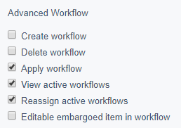

# Workflow permissions

## Adding groups and users

First of all, login to the CMS as an administrator. Ensure you have "Authors", "Editors" and "Managers" groups created
with a single user linked to each group (in the standard "Security" admin). Assign the six "Advanced Workflow"
permissions to each group.

## Workflow permissions

This section describes the different permission that can be assigned to a user, group or role.

### Create workflow

A user with this permission can create and change workflow definitions.

### Delete workflow

A user with this permission can delete:

 * workflow definitions
 * workflow instances

That means, if a user needs to completely stop and delete an active workflow, they would need this permission.

### Apply workflow

A user with this permission can choose which workflow should be used for an item. For instance, for a page this permission
will allow the user to change the workflow in a drop down under the _Page > Settings > Workflow_ tab.

### View active workflows

A user with this permission can view active workflows via the workflows admin panel.

### Reassign active workflows

A user with this permission can reassign active workflows to different users and groups.

### Editable embargoed item in workflow

A user with this permission can edit items that have been embargoed by a workflow.
